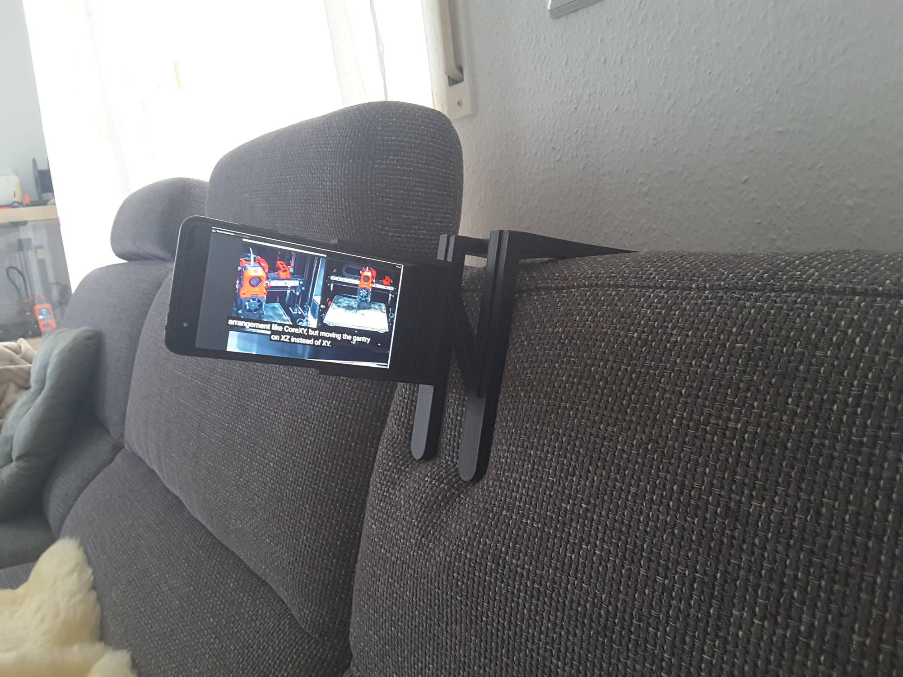
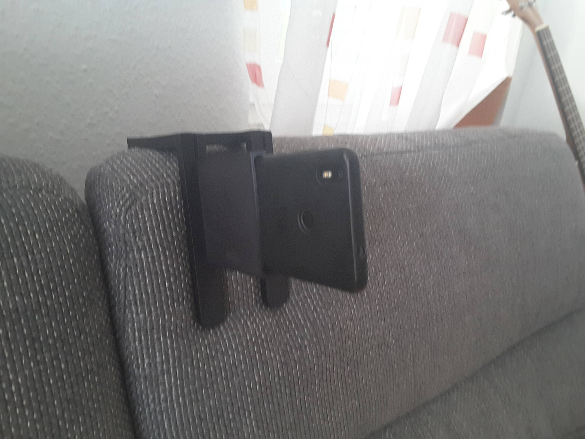
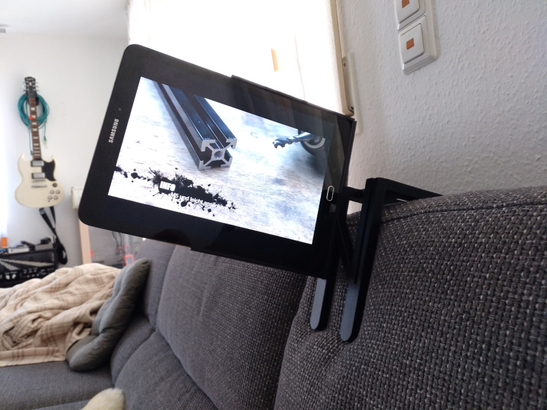
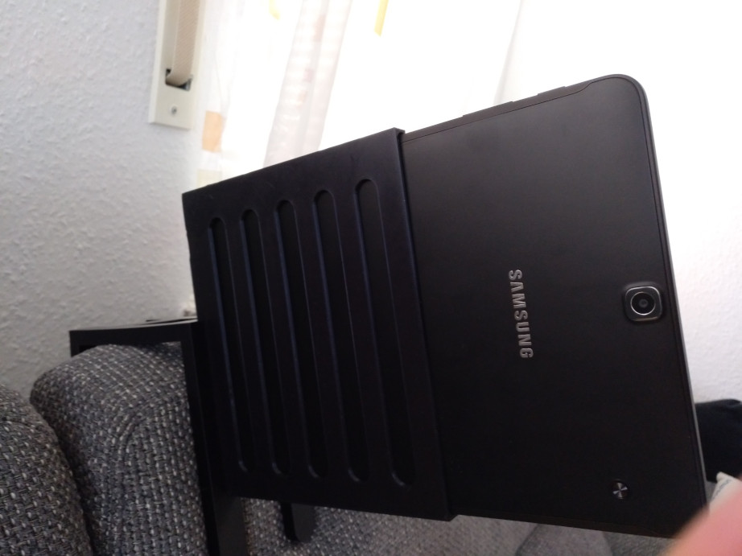
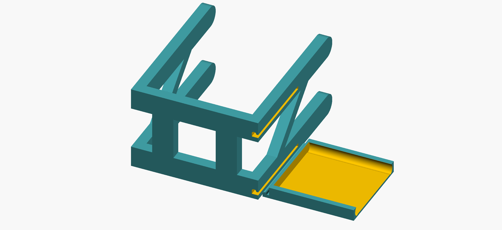
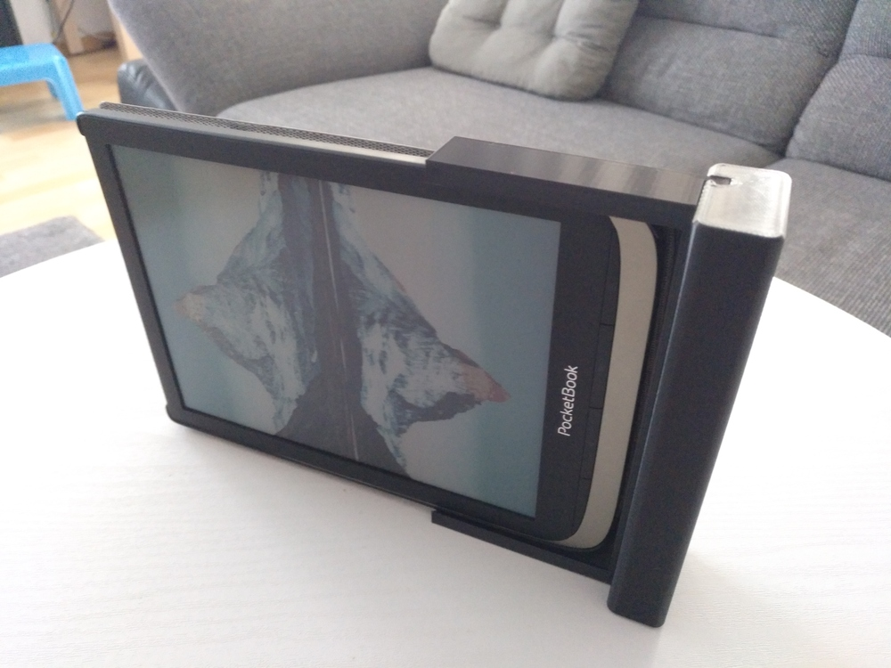
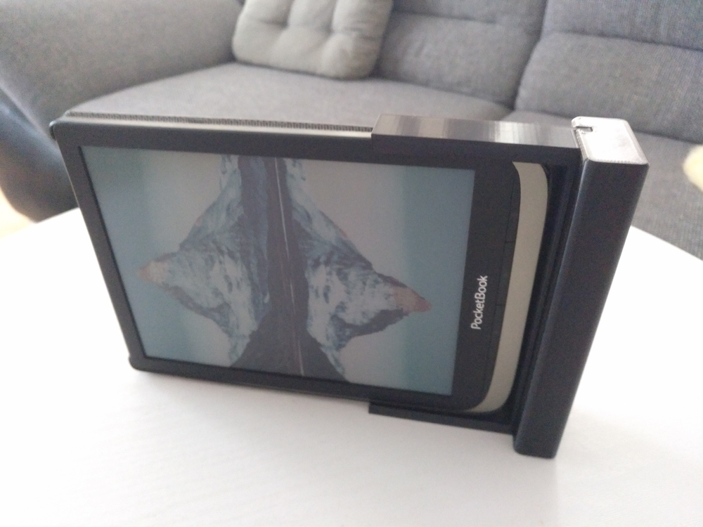
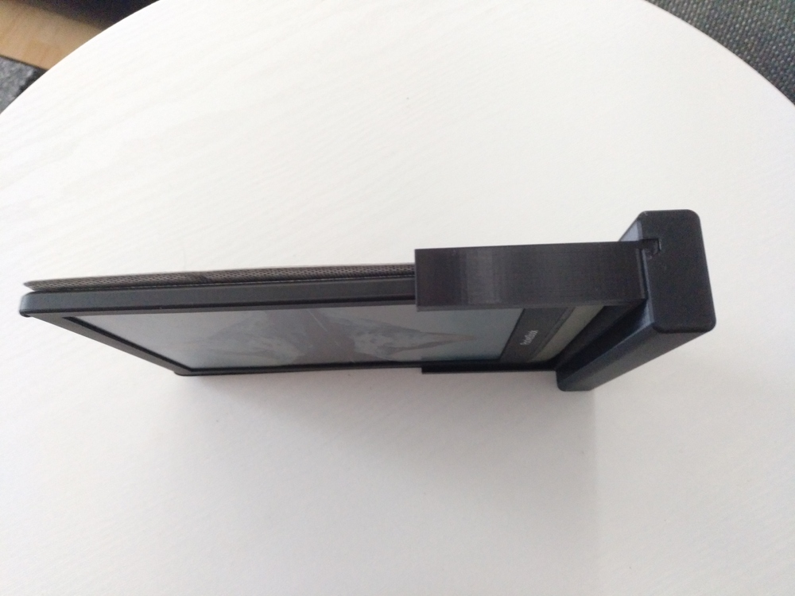
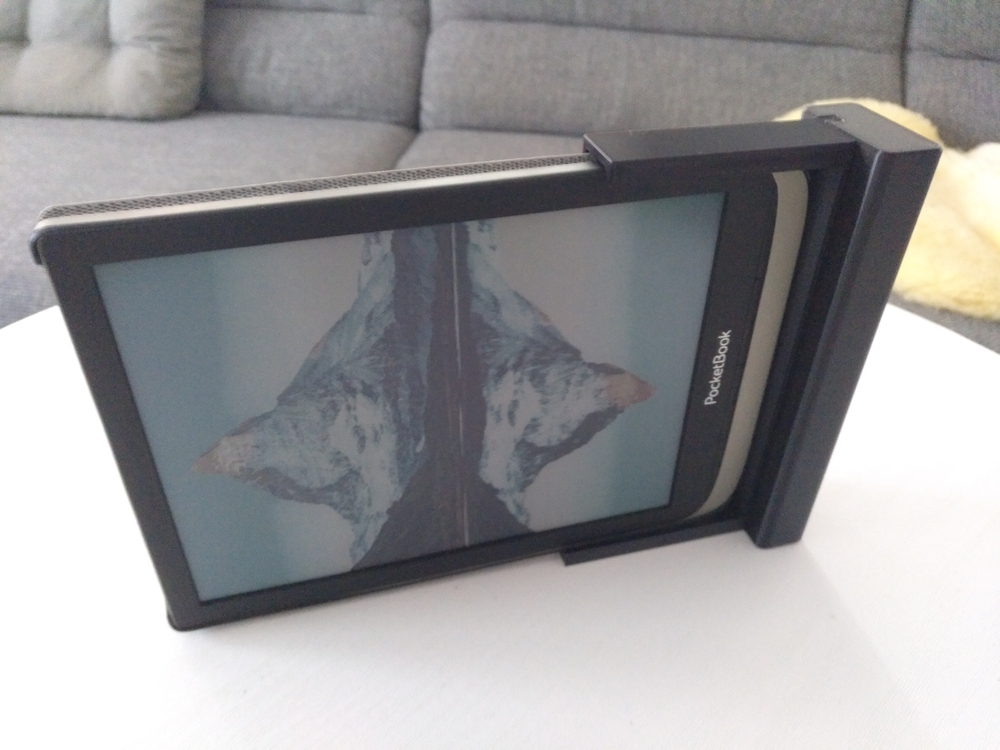
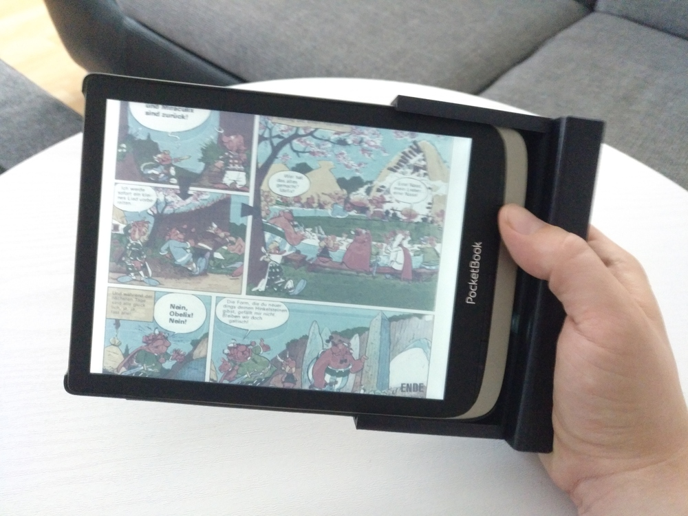

# CouchPotatoTools - Table/Phone Holder for your couch

Want to chilaxing on the couch without holding you smart phone, tablet or e-reader in your hand all the time? Use THIS!!!!1!!1!!

This is a profile which can be placed on the couch for example. It has a profile on the side to slide in into a holder for a smart phone, tablet or e-reader for watching videos or reading ebooks while chilaxing on the couch. No need to hold your device all the time ;).

Also reading comics on a PocketBook InkPad Color in landscape orientation is easier with the profile for this e-reader (including an origami case). For a comfortable hold I designed a hand handle where the profile can be slided in. This makes reading in landscape mode very easy.

The current phone holder is for a BQ Aquaris X with slim case.
The tablet holder has the size for a Galaxy Tab2 without case.
Holder for e-reader is for Pocketbook InkPad Color (or other 7.8" InkPad Readers)

E-Reader

# LICENSE

<dl>
 Dieses Werk ist lizenziert unter einer <a rel="license" href="http://creativecommons.org/licenses/by/4.0/">Creative Commons Namensnennung 4.0 International Lizenz</a>.
</dl>

<dl>
 This work is licensed under a <a rel="license" href="http://creativecommons.org/licenses/by/4.0/">Creative Commons Attribution 4.0 International License</a>.
</dl>
